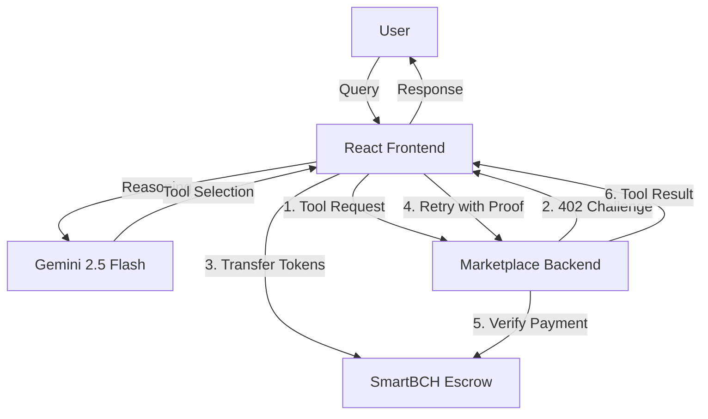

# Agent402: Autonomous AI Agents with On-Chain Payments

> **Built for the Bitcoin Cash Hackathon** — Powered by Gemini 2.5 Flash, SmartBCH, and the x402 payment protocol.

## What is Agent402?

Agent402 is a platform where **AI agents can autonomously discover, evaluate, and pay for tools and services** — no human in the loop. It combines Google's Gemini 2.5 Flash for real-time reasoning with low-cost on-chain payments on the Smart Bitcoin Cash Testnet, implementing the **HTTP 402 Payment Required** standard (x402).

An agent can browse a marketplace of paid tools (weather APIs, job boards, data services), decide which to use, pay for access using LINK/Tokens, and return the result — all in a single conversation turn.

---

## The Problem

Current AI agents can think but can't **act economically**:
- They can't hold funds or pay for API access.
- Every financial action requires a human to approve and execute.
- Sequential tool execution makes multi-tool tasks slow.
- Payment intents are often exposed or lack verifiable proof of service.

## The Solution

Agent402 gives AI agents **economic agency**:

| Capability | How |
|---|---|
| **Autonomous Payments** | Agent evaluates tool cost, pays in LINK/Token on SmartBCH. |
| **Secure Escrow** | Payments are held in a smart contract until the tool delivers the service. |
| **Parallel Execution** | Agents can pay for and execute multiple tools (e.g., "Weather in NY and Delhi") simultaneously. |
| **Real-Time Reasoning** | Gemini 2.5 Flash analyzes user intent and selects the cheapest/best tools. |
| **Open Marketplace** | Anyone can register paid tools — set your price, get paid instantly. |

---

## Architecture



### Components

| Component | Tech | Role |
|---|---|---|
| **Frontend** | React + Vite | User interaction, wallet management, AI orchestration. |
| **Backend** | Express.js + MongoDB | Tool marketplace, payment verification, Gemini proxy. |
| **Blockchain** | Smart Bitcoin Cash Testnet | Secure, low-cost settlement layer. |
| **Escrow Contract** | Solidity | Holds funds until service delivery is verified. |

---

## Payment Protocol: x402 (HTTP 402 Payment Required)

**x402** is our implementation of the HTTP 402 standard for machine-to-machine payments.

**The Flow:**
1.  **Discovery**: Agent calls a paid tool endpoint (e.g., `/tools/get_weather`).
2.  **Challenge**: Server returns `402 Payment Required` with `payTo` address and `amount`.
3.  **Settlement**: Agent transfers tokens to the Escrow Contract on SmartBCH.
4.  **Proof**: Agent retries the request with `X-Payment` header containing the transaction hash.
5.  **Verification**: Server verifies the on-chain event.
6.  **Delivery**: 
    - **Success**: Server releases funds from Escrow to the Tool Provider.
    - **Failure**: Server triggers a refund from Escrow back to the Agent.

---

## Tech Stack

- **AI Model**: Gemini 2.5 Flash (`gemini-2.5-flash`)
- **Frontend**: React 18, Vite, ethers.js v6
- **Backend**: Node.js, Express, MongoDB, Mongoose
- **Blockchain**: Smart Bitcoin Cash Testnet (Chain ID: 10001)
- **Smart Contracts**: Custom Escrow & ERC-20 Token
- **Wallet**: MetaMask (Browser Extension)

---

## Smart Contracts (SmartBCH Testnet)

| Contract | Address |
|---|---|
| **Payment Token (LINK)** | [`0x84b9B910527Ad5C03A9Ca831909E21e236EA7b06`](https://testnet.bscscan.com/address/0x84b9B910527Ad5C03A9Ca831909E21e236EA7b06) |
| **Escrow Contract** | [`0x14b848bE61C159908C0F1127C53Aa70dD0F2cBed`](https://testnet.bscscan.com/address/0x14b848bE61C159908C0F1127C53Aa70dD0F2cBed) |

---

## Setup & Installation

### Prerequisites
- Node.js 18+
- MongoDB (Local or Atlas)
- MetaMask Wallet
- BCH (for gas) & Testnet Tokens

### 1. Clone & Install
```bash
git clone https://github.com/anuragsinghbhandari/Agent402.git
cd Agent402

# Install Backend
cd MarketplaceBackend
npm install

# Install Frontend
cd ../AgentPayFrontend
npm install
```

### 2. Configure Environment
Create a `.env` file in `MarketplaceBackend/`:
```env
GEMINI_API_KEY=your_google_gemini_key
MONGODB_URI=mongodb://localhost:27017/agent402
BCH_RPC=https://moeing.tech:9545
ESCROW_CONTRACT_ADDRESS=0x14b848bE61C159908C0F1127C53Aa70dD0F2cBed
```

### 3. Run the Application
Open two terminals:

**Terminal 1 (Backend):**
```bash
cd MarketplaceBackend
node market.js
```

**Terminal 2 (Frontend):**
```bash
cd AgentPayFrontend
npm run dev
```
Visit `http://localhost:5173` in your browser.

---

## Usage Guide

1.  **Connect Wallet**: Click the "Connect Wallet" button. You'll need some BCH and the custom Testnet Token.
2.  **Ask a Question**: Type a query like *"What is the weather in New York?"*
3.  **Autonomous Payment**:
    - The agent identifies the `get_weather` tool.
    - It sees the cost (e.g., 0.01 Token).
    - It automatically pays the Escrow contract.
4.  **Result**: The tool delivers the weather data, and the funds are released to the provider.

**Advanced Queries**: Try *"What's the weather in New York, London, and Tokyo?"* to see the agent execute 3 parallel payments and tool calls at once!

---

## Future Roadmap

- **Multi-Agent Collaboration**: Agents hiring other agents for sub-tasks.
- **Mainnet Deployment**: Moving to SmartBCH Mainnet.
- **DAO Governance**: Community-curated tool marketplace.
- **Reputation System**: On-chain reputation for tool providers based on successful delivery.

---

## License
ISC

---
*Built for the Bitcoin Cash Hackathon*
