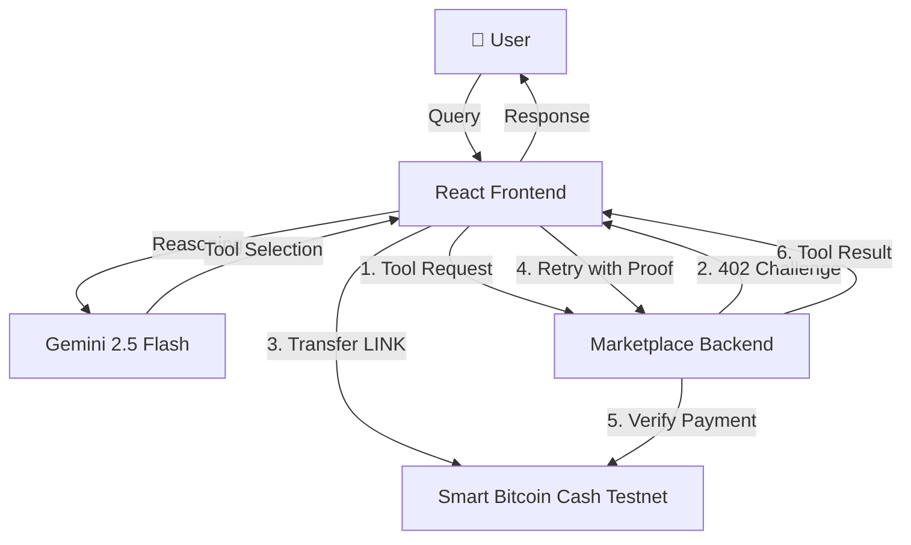

# Technical Architecture

## 🏗️ System Overview



## 🧩 Components

| Component | Tech | Role |
|---|---|---|
| **Frontend** | React + Vite | User interaction, wallet management, AI orchestration |
| **Backend** | Express.js + MongoDB | Tool marketplace, payment verification, Gemini proxy |
| **Blockchain** | Smart Bitcoin Cash Testnet (Chain ID: `10001`) | Low-cost LINK/Token payments for agent actions |
| **Agent Wallet** | ethers.js | Autonomous signing and transaction execution |

---

## 🔐 Payment Protocols

### x402 (HTTP 402 Protocol)
**x402** is our implementation of the HTTP 402 Payment Required standard, designed for autonomous agent payments.

**Flow:**
1.  **Discovery**: Agent calls a paid tool endpoint.
2.  **Challenge**: Server returns HTTP 402 with payment requirements (LINK amount, recipient address).
3.  **Settlement**: Agent transfers LINK/Token via ERC-20 `transfer()` to the tool provider's wallet (or escrow).
4.  **Proof**: Agent retries the request with `X-Payment` (tx hash) headers.
5.  **Verification**: Server verifies the ERC-20 Transfer event on-chain via transaction receipt logs.
6.  **Access**: Payment verified → tool executes and returns result.

---

## 🧾 Receipt System

Every tool call produces a structured receipt with 4 lifecycle phases:

1.  **INTENT**: Agent receives 402 challenge.
2.  **AUTHORIZATION**: Wallet signs mandate (if applicable).
3.  **SETTLEMENT**: On-chain transfer of funds.
4.  **DELIVERY**: Server verifies payment and delivers tool result.

This ensures full auditability of autonomous agent actions.

---

## 🚀 Tech Stack

| Layer | Technology |
|---|---|
| **AI** | Gemini 2.5 Flash (`gemini-2.5-flash`) |
| **Frontend** | React 18+ |
| **Backend** | Node.js, Express, MongoDB |
| **Chain** | Smart Bitcoin Cash Testnet |
| **Payment Token** | LINK (or custom ERC-20) |

---

## 📦 Setup & Installation

### Prerequisites
- Node.js 18+
- MetaMask browser extension
- BCH for gas
- LINK (Testnet Token) for payments

### 1. Clone & Install
```bash
git clone https://github.com/anuragsinghbhandari/Agent402.git
cd Agent402

# Backend
cd MarketplaceBackend
npm install

# Frontend
cd ../AgentPayFrontend
npm install
```

### 2. Configure Environment
Create `MarketplaceBackend/.env`:
```bash
GEMINI_API_KEY=your_gemini_api_key
MONGODB_URI=your_mongodb_connection_string
BCH_RPC=https://moeing.tech:9545
ESCROW_CONTRACT_ADDRESS=0x14b848bE61C159908C0F1127C53Aa70dD0F2cBed
```

### 3. Run
```bash
# Terminal 1: Backend
cd MarketplaceBackend
node market.js
# → Server running on http://0.0.0.0:3000

# Terminal 2: Frontend
cd AgentPayFrontend
npm run dev
# → Frontend running on http://localhost:5173
```
